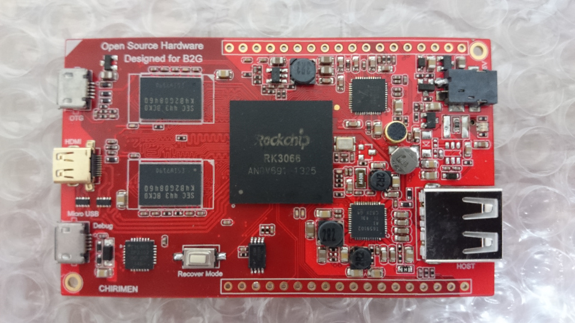

# CHIRIMEN

### Hardware Specs (Outline)
|  |  |
|:-----------|------------:
| SoC       | [RK3066](https://en.wikipedia.org/wiki/Rockchip#RK30xx_series) Cortex-A9 dual core, mali400 quad core GPU|
| Memory     |  DDR3 1GB |
| Storage  |  NAND Flash 8GB , 1 microSD slot |
| Dimension | 80mm x 48 mm |
| Video |  microHDMI female |
| USB | microUSB x 1 (OTG) , USB x 1 , microUSB x 1 (UART debug) |
| Network | via USB port |
| GPIO | > 1 (Configurable)|
| I2C | 2 |
| UART | 2 |
| SPI | 2 |
| Audio | analog stereo IN x 1 / OUT x 1 |
| PWM | 1 |
| Analog | IN x 1 |
| Price | TBD ... [See this slide](https://goo.gl/2W21kB)|
| | [Desiring price investigation](https://goo.gl/KPxBWm) |
